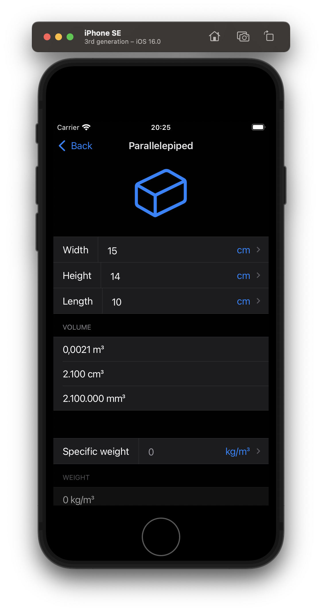

  

<h1 align="center">
  Shapes
</h1>

An mobile application to perform figure volume and weight calculations.

  
  

## Technologies

- [React](https://github.com/facebook/react)
- [React Native](https://github.com/facebook/react-native)
- [React Navigation](https://github.com/react-navigation/react-navigation)
- [i18n-js](https://github.com/fnando/i18n)
- [react-intl](https://github.com/formatjs/formatjs/tree/main/packages/react-intl)
